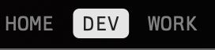
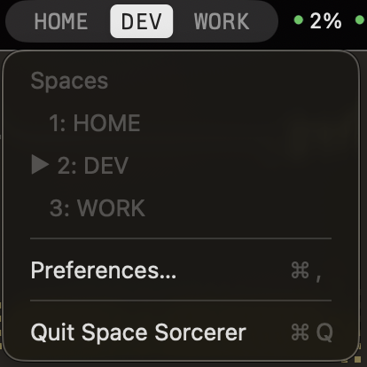
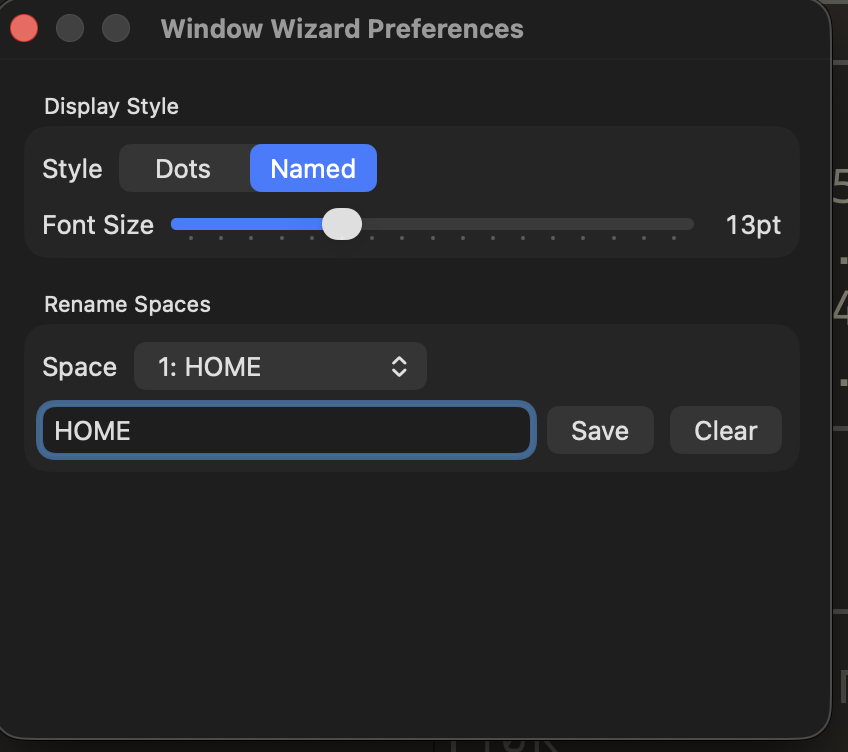

# Space Sorcerer

A lightweight macOS menu bar app that shows your desktop spaces at a glance.

## Features

- **Dot indicator** — filled circle for the current space, outlines for the rest
- **Named mode** — pill-shaped labels with custom space names
- **Custom naming** — rename any space from Preferences
- **Adjustable font size** — 8–24pt slider for the named display
- **Fullscreen detection** — marks fullscreen spaces with (FS)
- **Multi-display aware** — tracks spaces across all connected displays

## Requirements

- macOS 13 Ventura or later
- Apple Silicon or Intel

## Build & Run

```
swift build
.build/debug/SpaceSorcerer
```

The app runs as a menu bar icon with no Dock presence.

To create a standalone `.app` bundle:

```
./scripts/bundle.sh
open .build/release/SpaceSorcerer.app
```

## How It Works

Space Sorcerer queries macOS desktop spaces using private CoreGraphics APIs (`CGSCopyManagedDisplaySpaces`, `CGSGetActiveSpace`) re-exported through Apple's SkyLight framework. It listens for `activeSpaceDidChangeNotification`, `didChangeScreenParametersNotification`, and `didWakeNotification` to keep the indicator accurate across space switches, display changes, and sleep/wake cycles.

## Screenshots


*Named mode with custom space labels*


*Dropdown menu with space list and quick actions*


*Preferences panel for display style and space naming*

## Project Structure

```
Sources/
  CGSBridge/          C bridge to private CGS/SkyLight APIs
  SpaceSorcerer/
    main.swift         App entry point
    AppDelegate.swift  Wires observer, renderer, and status bar
    SpaceObserver.swift  Queries and monitors spaces
    SpaceRenderer.swift  Renders dot or named indicators
    StatusBarController.swift  Menu bar item and dropdown
    PreferencesWindow.swift    SwiftUI preferences panel
    Space.swift        Data models
```

## License

MIT
